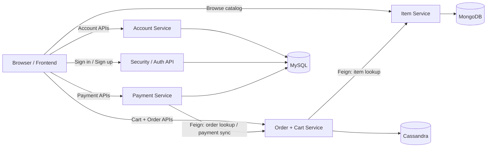
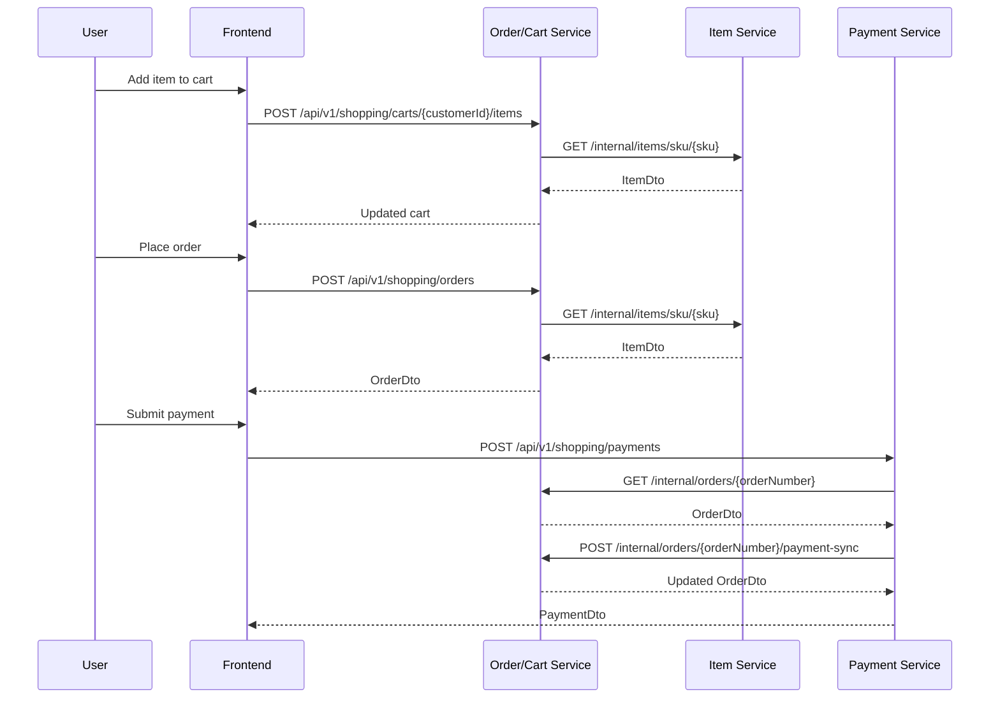

In this branch,
1. add new dependencies in pom.
```xml
<dependency>
<groupId>org.springframework.boot</groupId>
<artifactId>spring-boot-starter-validation</artifactId>
</dependency>
```

## Service Flow

The project is currently organized as four business services inside one repository:
- `account`
- `item`
- `order`
- `payment`

Shared infrastructure lives in:
- `security`
- `config`
- `exception`
- `shared`

### Runtime Communication

Synchronous service-to-service communication uses REST + JSON through OpenFeign.

Plain text view:

```text
Browser / Frontend
    |
    +--> Auth API ------------------------------> MySQL
    |
    +--> Account Service -----------------------> MySQL
    |
    +--> Item Service --------------------------> MongoDB
    |
    +--> Order / Cart Service ------------------> Cassandra
    |          |
    |          +--> Feign call to Item Service
    |
    +--> Payment Service -----------------------> MySQL
               |
               +--> Feign call to Order Service
```



### Request Flow Example



## Validation
Validation is applied to the online shopping request flows and form handling.


## acutator


## swagger


Please insert following records into `user_roles` tables before you sign up.
`insert into roles (name) values ("ROLE_USER");`
`insert into roles (name) values ("ROLE_ADMIN");`

## Local Databases

The shopping module expects three local databases:
- MySQL on `localhost:3306`
- MongoDB on `localhost:27017`
- Cassandra on `localhost:9042`

The project includes a Docker Compose file to start them:

```bash
docker-compose -f docker-compose.databases.yml up -d
```

Stop the databases:

```bash
docker-compose -f docker-compose.databases.yml stop
```

Start them again later:

```bash
docker-compose -f docker-compose.databases.yml start
```

Remove containers but keep data:

```bash
docker-compose -f docker-compose.databases.yml down
```

Remove containers and delete database data:

```bash
docker-compose -f docker-compose.databases.yml down -v
```

### Persistence

Data is persisted through Docker named volumes:
- `mysql_data`
- `mongo_data`
- `cassandra_data`

Your data stays if you use `stop`, `start`, or `down` without `-v`.
Your data is deleted only if you run `down -v` or manually remove the volumes.

### Database Names

- MySQL database: `online_shopping`
- MongoDB database: `online_shopping_item`
- Cassandra keyspace: `online_shopping_order`

### Connectivity Checklist

Check container status:

```bash
docker compose -f docker-compose.databases.yml ps
```

Check MySQL:

```bash
docker exec -it shopping-mysql mysql -uroot -pmyJava!1 -e "SHOW DATABASES;"
```

Check MongoDB:

```bash
docker exec -it shopping-mongo mongosh --eval "show dbs"
```

Check Cassandra:

```bash
docker exec -it shopping-cassandra cqlsh -e "DESCRIBE KEYSPACES;"
docker exec -it shopping-cassandra cqlsh -e "SELECT data_center FROM system.local;"
```

The Cassandra datacenter should be `datacenter1`, which matches `spring.data.cassandra.local-datacenter`.

### Run Order

1. Start the databases with Docker Compose.
2. Verify the three containers are healthy.
3. Start the Spring Boot application or deploy the app to local Tomcat.
