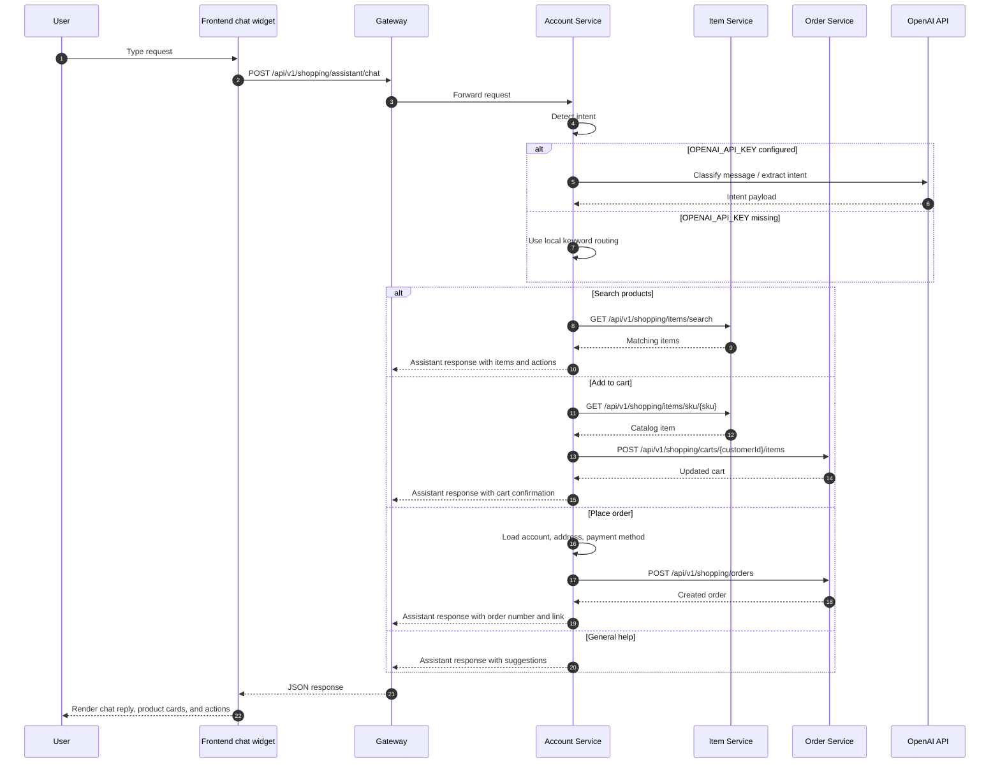

# Overview
The project is split into separate Spring Boot services so each part of the store has a clear boundary:

- `account-service` handles accounts, authentication, and user profile data
- `item-service` handles catalog data, product search, and inventory
- `order-service` handles cart and order lifecycle
- `payment-service` handles payment and refund workflows
- `gateway-service` is the browser/API entrypoint that routes requests to the right backend
- `shared-lib` contains DTOs, enums, and Feign contracts shared across services

Each service owns its own code and data. Services talk to each other over HTTP/Feign instead of sharing one large application layer.


# Services
- `account-service`
  - account APIs
  - sign in / sign up
  - frontend static pages
- `item-service`
  - item metadata
  - inventory
- `order-service`
  - cart
  - order lifecycle
- `payment-service`
  - payment and refund flows
- `gateway-service`
  - single browser/API entrypoint
  - routes frontend and API traffic to the right service
- `shared-lib`
  - Feign clients
  - shared inter-service DTOs and enums
  - shared exception contracts


# Ports
- account-service: `8081`
- item-service: `8082`
- order-service: `8083`
- payment-service: `8084`
- gateway-service: `8080`


# Database Split
Each business service uses its own database so the data model stays isolated:
- `account-service` uses `MySQL`
  - user accounts
  - sign in / sign up data
  - saved addresses and payment methods
- `item-service` uses `MongoDB`
  - product catalog
  - inventory records
  - search indexes and item attributes
- `order-service` uses `Cassandra`
  - carts
  - orders
  - order state transitions
- `payment-service` uses `MySQL`
  - payment records
  - refund records
  - payment status updates


# Inter-Service Communication
The services communicate with each other synchronously through Spring Cloud OpenFeign.

Why Feign is used:
- it gives typed Java clients instead of manual HTTP code
- it keeps internal service-to-service calls separate from public browser APIs
- it makes the dependencies explicit in code

Where the clients live:
- [ItemServiceClient.java](/Users/hhhhh1/Desktop/Training/Project/springboot-shopping/services/shared-lib/src/main/java/com/chuwa/shopping/client/ItemServiceClient.java)
- [OrderServiceClient.java](/Users/hhhhh1/Desktop/Training/Project/springboot-shopping/services/shared-lib/src/main/java/com/chuwa/shopping/client/OrderServiceClient.java)

Who calls whom:
- `order-service` calls `item-service` to load item details and adjust inventory
- `payment-service` calls `order-service` to read orders and sync payment status

Where Feign is enabled:
- [OrderServiceApplication.java](/Users/hhhhh1/Desktop/Training/Project/springboot-shopping/services/order-service/src/main/java/com/chuwa/shopping/orderservice/OrderServiceApplication.java)
- [PaymentServiceApplication.java](/Users/hhhhh1/Desktop/Training/Project/springboot-shopping/services/payment-service/src/main/java/com/chuwa/shopping/paymentservice/PaymentServiceApplication.java)

Public routes vs internal routes:
- public browser/API routes go through the gateway, like `/api/v1/shopping/orders/**`
- internal Feign routes use `/internal/api/v1/...`
- the internal routes are for service-to-service calls only, not direct browser access
This keeps the public API stable while allowing services to call each other directly when needed.

DTO Rule
- Service-local DTOs stay inside their own service.
  - Example: account page request/response models stay in `account-service`.
  - Example: cart request models stay in `order-service`.
- Only DTOs and enums exchanged between services belong in `shared-lib`.
  - Example: `ItemDto`, `InventoryDto`, `OrderDto`, `OrderLineItemDto`, `PaymentStatus`.
- Persistence entities stay inside the service that owns the data store.

This means:
- `shared-lib` is for Feign contracts and shared error types only.
- Business entities, repositories, and service-internal request payloads do not go into `shared-lib`.

# API Contract
The app exposes REST JSON APIs through the gateway on `http://localhost:8080`.

General rules:
- requests and responses use JSON
- public browser/API traffic goes through the gateway
- protected routes use `Authorization: Bearer <jwt>`
- public routes use `/api/v1/...`
- internal service-to-service routes use `/internal/api/v1/...`

## Public APIs
| Service | Method | Path | Purpose |
| --- | --- | --- | --- |
| account | POST | `/api/v1/auth/signin` | sign in and receive a JWT |
| account | POST | `/api/v1/auth/signup` | create a new user account |
| account | GET | `/api/v1/shopping/accounts/{accountId}` | get an account by id |
| account | GET | `/api/v1/shopping/accounts/me` | get the current signed-in account |
| account | POST | `/api/v1/shopping/assistant/chat` | shopping assistant chat |
| item | GET | `/api/v1/shopping/items` | list all items |
| item | GET | `/api/v1/shopping/items/search` | search items by text, category, brand, or stock |
| item | GET | `/api/v1/shopping/items/sku/{sku}` | get an item by SKU |
| item | POST | `/api/v1/shopping/items` | create an item |
| item | PUT | `/api/v1/shopping/items/{itemId}` | update an item |
| order | GET | `/api/v1/shopping/carts/{customerId}` | get the cart for a customer |
| order | POST | `/api/v1/shopping/carts/{customerId}/items` | add an item to cart |
| order | PUT | `/api/v1/shopping/carts/{customerId}/items/{itemId}` | update a cart item |
| order | DELETE | `/api/v1/shopping/carts/{customerId}/items/{itemId}` | remove a cart item |
| order | POST | `/api/v1/shopping/carts/{customerId}/checkout` | checkout the cart |
| order | POST | `/api/v1/shopping/orders` | create an order |
| order | PUT | `/api/v1/shopping/orders/{orderNumber}` | update an order |
| order | POST | `/api/v1/shopping/orders/{orderNumber}/cancel` | cancel an order |
| order | GET | `/api/v1/shopping/orders/{orderNumber}` | get an order by number |
| order | GET | `/api/v1/shopping/orders/customers/{customerId}` | list orders for a customer |
| payment | POST | `/api/v1/shopping/payments` | submit a payment |
| payment | PUT | `/api/v1/shopping/payments/{paymentNumber}` | update payment status |
| payment | POST | `/api/v1/shopping/payments/{paymentNumber}/refund` | refund a payment |
| payment | POST | `/api/v1/shopping/payments/{paymentNumber}/cancel` | cancel a payment |
| payment | GET | `/api/v1/shopping/payments/{paymentNumber}` | get payment details |

## Internal APIs
| Caller | Method | Path | Purpose |
| --- | --- | --- | --- |
| order-service | GET | `/internal/api/v1/shopping/items/sku/{sku}` | load authoritative item data |
| order-service | POST | `/internal/api/v1/shopping/items/sku/{sku}/inventory/adjustments` | update inventory after order/payment events |
| payment-service | GET | `/internal/api/v1/shopping/orders/{orderNumber}` | load the order before payment |
| payment-service | POST | `/internal/api/v1/shopping/orders/{orderNumber}/payment` | sync payment status back to order-service |

## Response Shapes
- authentication endpoints return token/login DTOs
- item APIs return item and inventory DTOs
- order APIs return cart and order DTOs
- payment APIs return payment DTOs
- assistant chat returns a structured assistant response with reply text, items, actions, and optional order metadata

# Spring Security and Auth
- `account-service` is the authentication server for the whole app.
- When a user signs in, it checks the username and password, then returns a signed JWT bearer token.
- The frontend stores that token and sends it as `Authorization: Bearer <token>` on protected requests.
- `item-service`, `order-service`, and `payment-service` run as JWT resource servers, so they validate the token before allowing access to protected APIs.
- `gateway-service` sits in front as the browser entrypoint and forwards each request to the correct backend service.

Key files:
- `OAuth2AuthorizationServerConfig` sets the security rules and JWT setup for `account-service`
- `JwtTokenService` creates the signed token after login
- `CustomUserDetailsService` loads the user from the database during login
- `RsaKeyProperties` creates or loads the RSA keys used to sign and verify tokens
- `AuthController` handles the core sign-in and basic sign-up flow
- `ItemSecurityConfig`, `OrderSecurityConfig`, and `PaymentSecurityConfig` protect the other services as JWT resource servers

Helper or optional files:
- `AuthOAuth2Controller` shows OAuth2 login/token info and examples
- `KeyInfoController` exposes key metadata and public-key info for debugging
- `OAuth2UserController` shows token/user details for debugging

The core auth flow is sign-in, token issuance, and JWT validation. The helper controllers are not required for normal app usage.


# Checkout Workflow (using Kafka) and Checkout Reliability
- `order-service` creates the order and publishes `OrderPlacedEvent`.
- `payment-service` consumes that event and runs the checkout workflow.
- The checkout workflow is:
  - reserve stock in `item-service`
  - capture payment
  - sync the final payment result back to `order-service`

Concurrency rule:
- `item-service` owns the inventory truth, stock is decremented atomically inside `item-service`
- if many customers try to buy the last units, only the first atomic inventory updates succeed
- the rest fail the stock check, which prevents overselling

At-least-once delivery:
- Kafka redelivers a message until the consumer acknowledges it.
- In this app, `payment-service` only acknowledges the Kafka record after the checkout step finishes or a final failure is recorded.
- If the consumer throws before `acknowledge()`, Kafka will deliver the same event again.

Idempotency:
- `payment-service` saves the payment row before it throws, so a redelivery resumes from the same checkpoint instead of creating a second payment attempt.
- `item-service` requires a unique `operationId` for each inventory adjustment, so the same stock change cannot be applied twice.
- `order-service` stores processed payment sync ids, so the same payment result does not update the order twice.

Recovery and compensation:
- If stock was already reserved and payment later fails, `payment-service` restocks before marking the order failed.
- If payment fails before stock is reserved, the message is not acked and Kafka retries it.
- Each service saves its own state, retries are safe, and the compensating action is `RESTOCK` when a reserved purchase cannot complete.
- If payment is captured but the order sync still fails, the saved payment state lets the next retry continue from the same payment record instead of charging again.


# Product Search
- Category browsing loads directly from MongoDB.
- Text search uses Elasticsearch.
- MongoDB stores the real product records. Elasticsearch stores a searchable copy of those records.
- When an item is created or updated, the app re-indexes it into Elasticsearch.
- Search box requests go to `GET /api/v1/shopping/items/search?q=...`.

Key documents:
- `ItemSearchDocument` defines what product fields are indexed in Elasticsearch and how they are mapped.
- `ItemSearchIndexer` copies MongoDB items into Elasticsearch.
- `ItemSearchService` runs the Elasticsearch text search. This is the search engine logic.
- `ItemSearchRepository` is the Spring Data Elasticsearch repository for saving/searching indexed items.
- `ItemElasticsearchConfig` and `ItemSearchConfig` enable and initialize search support.


# One-Click Startup

```bash
cd services
docker-compose -f docker-compose.yml up --build
```

Or:

```bash
cd services
sh start-all.sh
```

This starts:

- MySQL for account and payment
- MongoDB for item
- Cassandra for order
- Kafka for payment/order asynchronous events
- account, item, order, payment, and gateway services

Recommended browser entrypoint:

- `http://localhost:8080`

# Local Dev Loop

Use this when you want to change code and retest without rebuilding Docker images.

All Maven commands below must be run from the `services/` directory:

```bash
cd springboot-shopping/services
```

Bootstrap the shared module once before running any service:

```bash
sh bootstrap-local.sh
```

Start only the infrastructure once:

```bash
cd services
sh start-infra.sh
```

This script first removes any old compose containers for the infra services, then recreates them.
It also waits until MySQL, MongoDB, Cassandra, and Kafka are reachable before returning.

If you want to clean everything manually first, run:

```bash
cd services
sh cleanup-infra.sh
```

Then run the services from source in separate terminals:

```bash
cd services
sh scripts/run-service.sh account-service
```

```bash
cd services
sh scripts/run-service.sh item-service
```

```bash
cd services
sh scripts/run-service.sh order-service
```

```bash
cd services
sh scripts/run-service.sh payment-service
```

If you want the browser entrypoint, also run:

```bash
cd services
sh scripts/run-service.sh gateway-service
```

Notes:

- The services already default to `localhost` ports in their `application.properties`.
- You only need to restart the service you changed.
- If you change `shared-lib`, restart the services that depend on it.
- If `shared-lib` changes, rerun `sh bootstrap-local.sh` before starting services again.
- `sh scripts/run-service.sh <service-dir>` loads `services/.env.local` automatically before running Maven.
- Kafka uses `localhost:29092` when services run from source, and `kafka:9092` when services run in Docker.
- Use `http://localhost:8080` for the gateway or `http://localhost:8081` through `http://localhost:8084` for direct service testing.


# Shopping Assistant

The home page includes a shopping assistant chat widget.

What it can do:

- search products
- add products to cart
- place an order when the user is signed in and has the required account data

Where the OpenAI key goes:

- copy [`.env.local.example`](/Users/hhhhh1/Desktop/Training/Project/springboot-shopping/services/.env.local.example) to `.env.local` in `services/`
- set `OPENAI_API_KEY` there once for this project
- `scripts/start-all.sh`, `scripts/start-infra.sh`, and `scripts/bootstrap-local.sh` load that file automatically
- optional override: `SHOPPING_ASSISTANT_MODEL` (default: `gpt-5.1`)
- IntelliJ Spring Boot runs also pick up `services/.env.local` through `LocalEnvPropertySourceConfig`
- the frontend never talks to OpenAI directly

If `OPENAI_API_KEY` is missing, the backend returns an error instead of silently falling back.
That makes setup problems obvious while you are testing the assistant.

Request flow:



API contract:

- request: `POST /api/v1/shopping/assistant/chat`
- body: `{ "message": "find me a coffee maker" }`
- response fields:
  - `intent`
  - `reply`
  - `requiresSignIn`
  - `orderNumber`
  - `checkoutUrl`
  - `items`
  - `actions`

Important note:

- the assistant does not replace the normal catalog search endpoint
- product lookup still uses the existing item-service search APIs
- OpenAI is only used to interpret the user's intent, not to fetch product data
